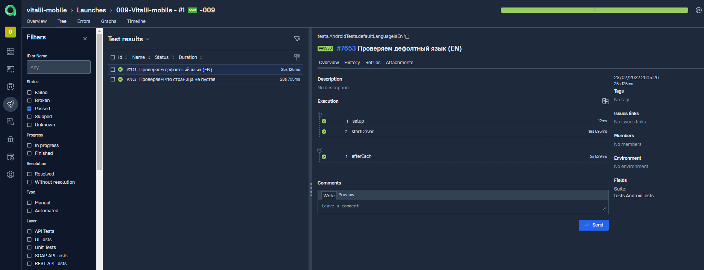

# Проект по мобильной автоматизации на базе  [browserstack.com](https://www.browserstack.com/)

## Technology Stack:

| Java | Selenide | Gradle | Junit5 | Selenoid | Jenkins | IntelliJ IDEA | Allure Report | Allure Testops | Telegram |
|:------:|:----:|:------:|:------:|:--------:|:--------:|:-------------:|:---------:|:---------:|:--------:|
|  |  |  |  |  |  |  |  |  |  |


## Allure TestOps

Смотри отчёт о прохождении автотестов в Allure Report


Подробный отчет по тестам в Allure Report


## Хранение тестовой документации в Allure TestOps



## Интерграция с Jira


## Запускай тесты удаленно через - Jenkins job!


## Параметры запуска

Run tests locally:
```bash
gradle clean test
```

Serve report:
```bash
allure serve build/allure-results
```