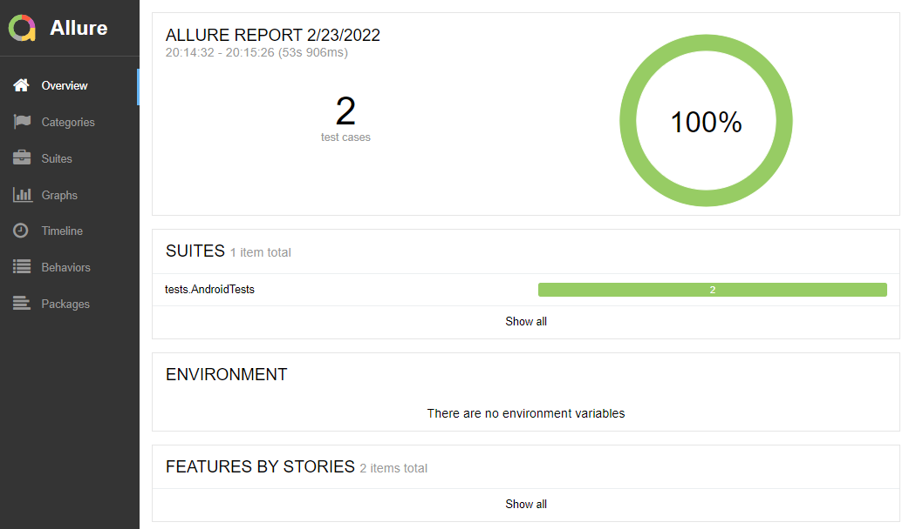
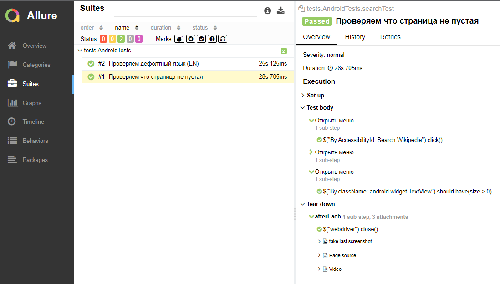
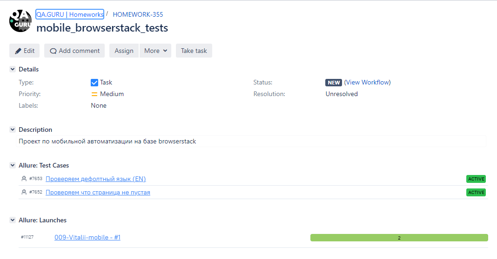
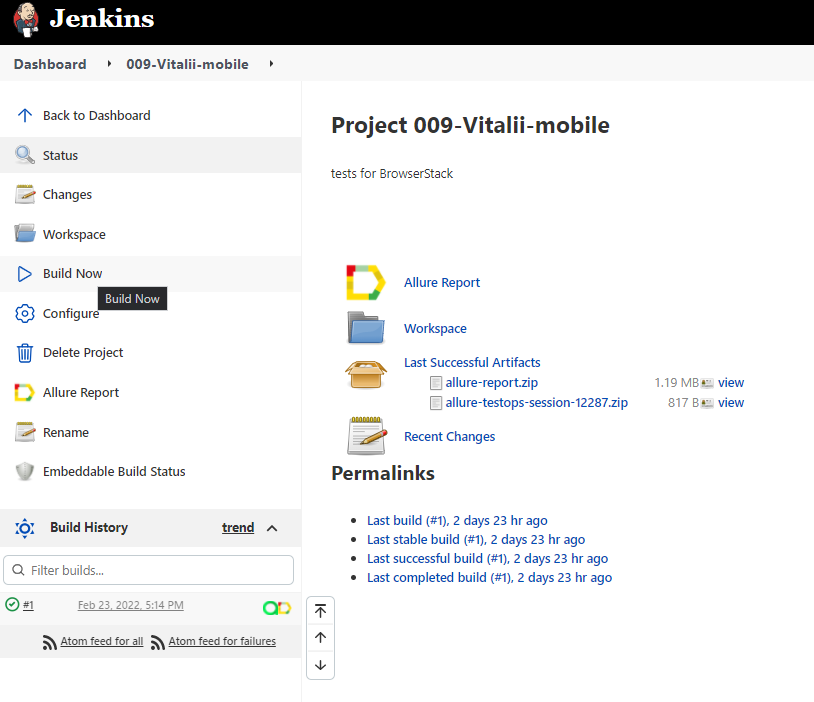

# Проект по мобильной автоматизации на базе [browserstack.com](https://www.browserstack.com/)

## Технологический стек::

| Java | Selenide | Gradle | Junit5 | Selenoid | Jenkins | IntelliJ IDEA | Allure Report | Allure Testops | Telegram |
|:------:|:----:|:------:|:------:|:--------:|:--------:|:-------------:|:---------:|:---------:|:--------:|
|  |  |  |  |  |  |  |  |  |  |


## Параметры запуска

Run tests locally:
```bash
gradle clean test
```

Serve report:
```bash
allure serve build/allure-results
```


## Отчеты о прохождении тестов можно смотреть в Allure Report



Подробный отчет по тестам в Allure Report



## Хранение тестовой документации организовано в Allure TestOps


## Настроена интерграция с Jira



## Удаленный запуск тестов возможен через - Jenkins job




